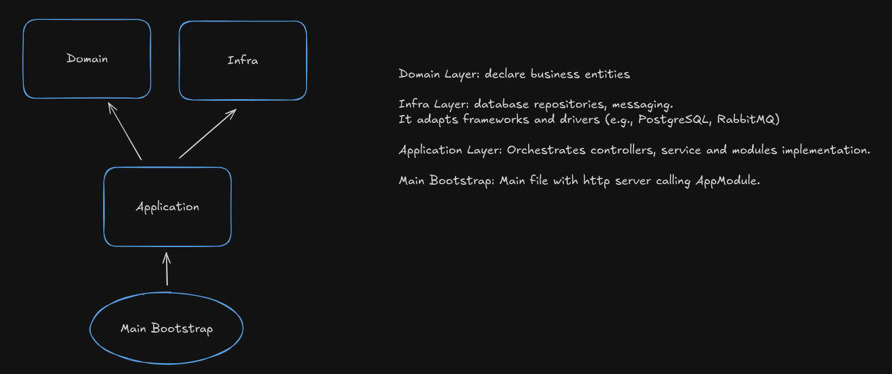

# Ledger Challenge

## Resume

A financial ledger service that manages accounts and records credit/debit movements with transactional integrity and message publishing. Built with NestJS, TypeORM, and PostgreSQL, it exposes REST endpoints to create accounts, register movements, and retrieve the current balance and available credit limit. Movements are published to RabbitMQ for downstream processing, and a consumer service can log messages for auditing and reprocessing.

## Required

- [Docker-Compose](https://docs.docker.com/compose/install/linux/)
- [Node (>=20)](https://nodejs.org/en/)

## Design Architecture



## How to execute locally (DOCKER COMPOSE)

Install dependencies

```
npm ci
```

Run docker compose command to up postgresql and RabbitMQ

```
docker compose up -d
```

Run build script to build project and run database migrations

```
npm run build
```

Start API

```
npm start
```

## Routes (curls)

**POST Accounts**

```bash
  curl -d '{"name":"NameTest","document": "12433","email": "email@mail.com"}' \
  -H 'Content-Type: application/json' \
  http://localhost:3000/accounts
```

**GET Account**

```bash
curl 'http://localhost:3000/accounts/:account_id/balance'
```

**POST Movements**

```bash
curl -d '{"accountId": "{{accountIdGenerated}}","amount": 200,"type": "DEBIT","description": "Teste"}' \
-H 'Content-Type: application/json' \
'http://localhost:3000/movements'

```
